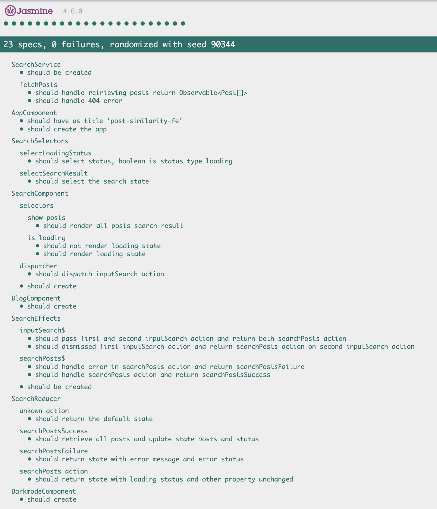

# Semantic Search Front End

This is a front-end project built with Angular, NgRx, and Tailwind CSS, designed to demonstrate semantic search for a web application. This project was generated with [Angular CLI](https://github.com/angular/angular-cli) version 16.2.0.


## Features

- **Angular:** The application is built with Angular, a powerful framework for building dynamic and responsive web applications.

- **NgRx:** NgRx is used for state management, allowing for a predictable and centralized way to handle application data and UI interactions.

- **Tailwind CSS:** The application is styled with Tailwind CSS, a highly customizable and utility-first CSS framework.

- **Firebase Hosting:** The application is hosted on Firebase Hosting, using client-side rendering.

## Prerequisites

Before you begin, ensure you have met the following requirements:

- **Node.js:** If you haven't already, install Node.js from [nodejs.org](https://nodejs.org/).

- **Angular CLI:** Install the Angular CLI globally using the following command:

```bash
npm install -g @angular/cli
```

- **Dependencies:** Install the dependencies using the following command:

```bash
npm install
```

- **Firebase:** Initialize Firebase:

```bash
firebase init
```

## Build

Run `ng build` to build the project. The build artifacts will be stored in the `dist/` directory.

## Running unit tests

Run `ng test` to execute the unit tests via [Karma](https://karma-runner.github.io).



## Development server

Run `ng serve` for a dev server. Navigate to `http://localhost:4200/`. The application will automatically reload if you change any of the source files.

## Deployment

Run `ng deploy` / `firebase deploy --only hosting` to build and deploy to firebase hosting.
